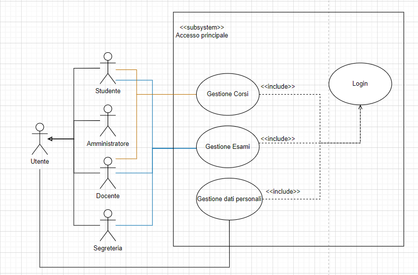
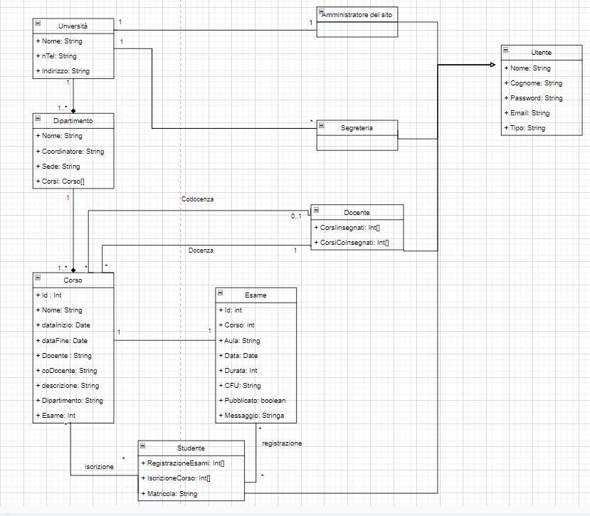
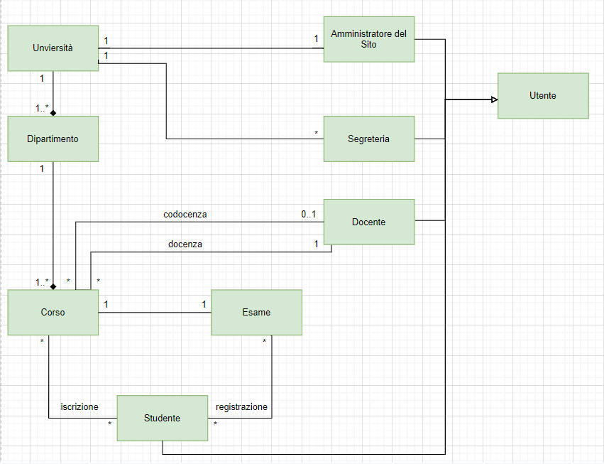
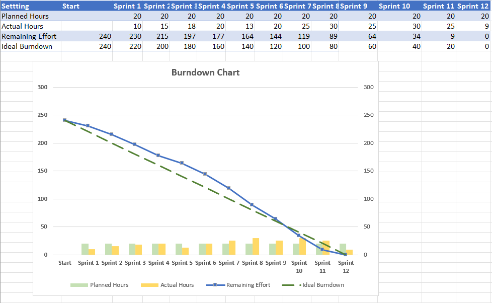
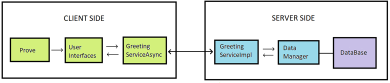

# progetto-ing-gwt
Progetto ING GWT
# Indice

1. [Inception](#inception)

    1.1 [Modello casi d'uso](#modellicasiduso)

    1.2 [Descrizione casi d'uso](#casiduso)

    1.2.1 [Caso d'uso UC1](#cd1)

    1.2.2 [Caso d'uso UC1.1](#cd1.1)

    1.2.3 [Caso d'uso UC1.1.1](#cd1.1.1)

    1.2.4 [Caso d'uso UC1.1.2](#cd1.1.2)

    1.2.5 [Caso d'uso UC1.1.3](#cd1.1.3)

    1.2.6 [Caso d'uso UC1.2](#cd1.2)

    1.2.7 [Caso d'uso UC1.2.1](#cd1.2.1)

    1.2.8 [Caso d'uso UC1.2.2](#cd1.2.2)

    1.2.9 [Caso d'uso UC1.2.3](#cd1.2.3)

    1.2.10 [Caso d'uso UC1.3](#cd1.3)

    1.2.11 [Caso d'uso UC1.3.1](#cd1.3.1)

    1.2.12 [Caso d'uso UC1.5](#cd1.5)

    1.2.13 [Caso d'uso UC1.5.1](#cd1.5.1)

    1.2.14 [Caso d'uso UC1.6](#cd1.6)

    1.2.15 [Caso d'uso UC1.6.1](#cd1.6.1)

    1.2.16 [Caso d'uso UC1.6.2](#cd1.6.2)

    1.2.17 [Caso d'uso UC1.7](#cd1.7)

    1.2.18 [Caso d'uso UC1.7.1](#cd1.7.1)

    1.2.19 [Caso d'uso UC1.7.2](#cd1.7.2)

    1.2.20 [Caso d'uso UC1.8](#cd1.8)

    1.2.21 [Caso d'uso UC1.8.1](#cd1.8.1)

    1.2.21 [Caso d'uso UC1.8.2](#cd1.8.2)

    1.3 [Diagramma di dominio](#modellodominio)

    1.4 [Glossario](#gloassario)

2. [Construction](#construction)

   2.1 [Descrizone del metodo adottato](#descr)

   2.2 [Diario](#diario)

   2.3 [Bacheca Trello](#trello)

   2.4 [Burndown Chart](#burn)

   2.5 [Scelte progettuali e di interfaccia](#scelteProg)

   2.6 [Manuale](#manuale)

***

# 1 Inception <a name="inception"></a>

L'inception è una fase de processo di sviluppo che ha lo scopo di produrre le specifiche dei requisiti in modo tale che siano chiare, le più complete possibili e funzionali, utilizzando varie tecniche. Lo scopo dell'inception è produrre una visione condivisa degli obiettivi e dei contenuti di un progetto.

## 1.1 Modelli casi d'uso <a name="modellicasiduso"></a>

Modello casi d'uso accesso principale


Modello casi d'uso gestione dati personali


Modello casi d'uso gestione corsi


Modello casi d'uso gestione esami


## 1.2 Descrizione casi d'uso <a name="casiduso"></a>

Si riportano i casi d'uso riportati d'urante l'attività di Analisi dei Requisiti specificando per ognuno il codice gerarchico ed un titolo, i vari sttori coinvolti, una descrizine testuale, eventuali precondizioni, il flusso degli eventi descritto del caso d'uso e la sua post condizione.

<br>

### Caso d'uso UC1: Portale Università <a name="cd1"></a>

- **Attori:** Amministratore, Docente, Segreteria, Studente;

- **Scopo e descrizione:** Gli attori hanno avviato correttamente il programma e questo è pronto all'uso. Gli attori inseriscono le loro credenziali per accedere al sistema, quindi ogni tipologia di attori può scegliere le operazioni da svolgere a seconda del loro ruolo:

  - Amministratore: gestione account studenti, gestione account segreteria/docente;

  - Docente: gestione corsi, gestione esami;

  - Segreteria: visualizza dati studenti,
  - inserimento voti studenti;

  - Studenti: gestione corsi a cui sei iscritto, gestione esami;

- **Precondizone:** Il sistema è pronto a ricevere le scelte dell'utente;

- **Flusso principale degli eventi:**

    1. L'amministratore può gestire gli account studenti (UC1.1);

    2. L'amministratore può gestire gli utenti segreteria/docente (UC1.2);

    3. La segreteria può visualizzare l'elenco degli studenti (UC1.3);

    4. La segreteria può inserire i voti studenti (UC1.4);

    5. Il docente può gestire i corsi (UC1.5);

    6. Il docente può gestire gli esami (UC1.6);

    7. Lo studente può gestire i corsi (UC1.7);

    8. Lo studente può gestire gli esami (UC1.8);

<br>

### Caso d'uso UC1.1: Gestione account studenti <a name="cd1.1"></a>

- **Attori:** Amministratore;

- **Scopo e descrizione:**  L'amministratore può scegliere le operazioni da svolgere riguardante la gestione degli account degli studenti. L'amministratore visualizza l'elenco degli studenti registrati e può modificare o eliminare gli studenti o aggiungere un nuovo account;

- **Precondizone:** Il sistema è pronto a caricare l'elenco degli studenti;

- **Flusso principale degli eventi:**

    1. L'amministratore può aggiungere un account studente (UC1.1.1);

    2. L'amministratore può eliminare un account studente (UC1.1.2);

    3. L'amministratore può modificare un account studente (UC1.1.3);

- **Post condizone:** Il sistema ha caricato correttamente la lista degli studenti registrarti nel portale;

<br>

### Caso d'uso UC1.1.1: Aggiungere account studente <a name="cd1.1.1"></a>

- **Attori:** Amministratore;

- **Scopo e descrizione:**  L'amministratore può aggiungere un nuovo studente rispettando i campi richiesti: Nome, Cognome, Matricola, Email, Password;

- **Precondizone:** Il sistema è pronto a ricevere e controllare le informazioni del nuovo studente;

- **Post condizone:** Il sistema ha ricevuto e controllato correttamente i parametri inseriti dall'aministratore e ha inserito un nuovo studente nella banca dati;

<br>

### Caso d'uso UC1.1.2: Eliminare account studente <a name="cd1.1.2"></a>

- **Attori:** Amministratore;

- **Scopo e descrizione:**  L'amministratore può eliminare uno studente presente nella banca dati;

- **Precondizone:** Il sistema è pronto a ricevere il comando dall'aministratore;

- **Post condizone:** Il sistema ha ricevuto correttamente il comando di eliminazione e ha eliminato lo studente dalla banca dati;

<br>

### Caso d'uso UC1.1.3: Modificare account studente <a name="cd1.1.3"></a>

- **Attori:** Amministratore;

- **Scopo e descrizione:**  L'amministratore può modificare i parametri di uno studenti esistente nella banca dati;

- **Precondizone:** Il sistema è pronto a ricevere i nuovi parametri da aggiornare allo studente;

- **Post condizone:** Il sistema ha ricevuto e controllato correttamente i nuovi parametri inseriti dall'aministratore e ha modificato lo studente esistente nella banca dati;

<br>

### Caso d'uso UC1.2: Gestione account segreteria/docenti <a name="cd1.2"></a>

- **Attori:** Amministratore;

- **Scopo e descrizione:**  L'amministratore può scegliere le operazioni da svolgere riguardante la gestione degli account della segreteria e dei docenti. L'amministratore visualizza l'elenco degli utenti segreteria e docenti registrati e può modificare, eliminare o aggiungere un nuovo account;

- **Precondizone:** Il sistema è pronto a caricare l'elenco degli accounti della segreterie e dei docenti;

- **Flusso principale degli eventi:**

    1. L'amministratore può aggiungere un account segreteria o docente (UC1.2.1);

    2. L'amministratore può eliminare un account segreteria o docente (UC1.2.2);

    3. L'amministratore può modificare un account segreteria o docente (UC1.2.3);

- **Post condizone:** Il sistema ha caricato correttamente la lista degli utenti segreteria e docenti registrarti nel portale;

<br>

### Caso d'uso UC1.2.1: Aggiungere account segreteria o docente <a name="cd1.2.1"></a>

- **Attori:** Amministratore;

- **Scopo e descrizione:**  L'amministratore può aggiungere un nuovo account segreteria o decente rispettando i campi richiesti: Nome, Cognome, Matricola, Email, Password e Tipologia account;

- **Precondizone:** Il sistema è pronto a ricevere e controllare le informazioni del nuovo account segreteria o docente a seconda della tipologia di account selezionata dall'aministratore;

- **Post condizone:** Il sistema ha ricevuto e controllato correttamente i parametri inseriti dall'aministratore e ha inserito un nuovo account segreteria o docente nella banca dati;

<br>

### Caso d'uso UC1.2.2: Eliminare account segreteria o docente <a name="cd1.2.2"></a>

- **Attori:** Amministratore;

- **Scopo e descrizione:**  L'amministratore può eliminare unaccount segreteria o docente presente nella banca dati;

- **Precondizone:** Il sistema è pronto a ricevere il comando dall'aministratore;

- **Post condizone:** Il sistema ha ricevuto correttamente il comando di eliminazione e ha eliminato l'account segreteria o docente dalla banca dati;

<br>

### Caso d'uso UC1.2.3: Modificare account segreteria o docente <a name="cd1.2.3"></a>

- **Attori:** Amministratore;

- **Scopo e descrizione:**  L'amministratore può modificare i parametri di un'account segreteria o docente esistente nella banca dati;

- **Precondizone:** Il sistema è pronto a ricevere i nuovi parametri da aggiornare all'account segreteria o docente;

- **Post condizone:** Il sistema ha ricevuto e controllato correttamente i nuovi parametri inseriti dall'aministratore e ha modificato l'account segreteria o studente esistente nella banca dati;

<br>

### Caso d'uso UC1.3: Visualizzare elenco studenti <a name="cd1.3"></a>

- **Attori:** Segreteria;

- **Scopo e descrizione:**  L'account segreteria sceglie di visualizzare l'elenco degli studenti presenti nella banca dati;

- **Precondizone:** Il sistema è pronto a caricare l'elenco degli studenti;

- **Flusso principale degli eventi:**

    1. La segreteria può visualizzare i corsi e gli esami in cui è iscritto ogni studente (UC1.3.1);

- **Post condizone:** Il sistema ha caricato correttamente la lista degli studenti presenti nella banca dati;

<br>

### Caso d'uso UC1.3.1: Visualizzare corsi e esami studenti <a name="cd1.3.1"></a>

- **Attori:** Segreteria;

- **Scopo e descrizione:**  L'account segreteria sceglie di visualizzare l'elenco dei corsi e degli esami a cui è regisrato uno studente;

- **Precondizone:** Il sistema è pronto a ricevere lo studente da parte della segreteria;

- **Post condizone:** Il sistema ha caricato correttamente la lista dei corsi e degli esami a cui è registrato lo studente selezionato;

<br>

### Caso d'uso UC1.5: Gestione corsi <a name="cd1.5"></a>

- **Attori:** Docente;

- **Scopo e descrizione:**  Il docente può scegliere le operazioni da svolgere riguardante la gestione dei propri corsi. il docente visualizza l'elenco dei propri corsi e può modificare, eliminare o aggiungere un nuovo corso;

- **Precondizone:** Il sistema è pronto a caricare l'elenco dei corsi tenuti dal docente;

- **Flusso principale degli eventi:**

    1. Il docente può aggiungere un nuovo corso (UC1.5.1);

- **Post condizone:** Il sistema ha caricato correttamente la lista dei corsi associati a quel docente;

<br>

### Caso d'uso UC1.5.1: Aggiungere un nuovo corso <a name="cd1.5.1"></a>

- **Attori:** Docente;

- **Scopo e descrizione:**  Il docente può aggiungere un nuovo corso rispettando i campi obbligatori richiesti: nome, cfu, data inizio, data fine, descrizione, dipartimento o inserendo anche i campi facoltativi come codocente o associare direttamente un esame al corso che si sta creando;

- **Precondizone:** Il sistema è pronto a ricevere e controllare le informazioni del nuovo corso;

- **Post condizone:** Il sistema ha ricevuto e controllato correttamente i parametri inseriti dal docente e ha inserito un nuovo corso nella banca dati;

<br>

### Caso d'uso UC1.6: Gestione esami <a name="cd1.6"></a>

- **Attori:** Docente;

- **Scopo e descrizione:**  Il docente può scegliere le operazioni da svolgere riguardante la gestione dei propri esami. Il docente visualizza l'elenco dei propri corsi che non possengono un esame e può aggiungere un esame ad essi, visualizza la lista degli esami da svolgere, visualizza la lista degli esami svolti con voti, visualizza la lista degli esami svolti senza voti e poter inserire i voti agli studenti iscritti a quell'esame;

- **Precondizone:** Il sistema è pronto a caricare l'elenco degli esami tenuti dal docente;

- **Flusso principale degli eventi:**

    1. Il docente può aggiungere un nuovo esame ai corsi che non nè posseggono (UC1.6.1);

    2. Il docente può aggiungere i voti agli studenti di un esame che è svolto (UC1.6.2);

- **Post condizone:** Il sistema ha caricato correttamente la lista degli esami gestiti da quel docente;

<br>

### Caso d'uso UC1.6.1: Aggiungere esame a corso senza esame <a name="cd1.6.1"></a>

- **Attori:** Docente;

- **Scopo e descrizione:**  Il docente può aggiungere un esame ad un corso che non nè possiede nessuno, rispettando i campi obbligatori richiesti: nome, durata, data, cfu, aula;

- **Precondizone:** Il sistema è pronto a ricevere e a controllare i parametri per inserire il nuovo esame;

- **Post condizone:** Il sistema ha ricevuto e controllato correttamnete i parametri per il nuovo esame inseriti dal docente e ha inserito il nuovo esame alla banca dati e ha attribuito id del nuovo esame a l'idEsame del corso associato;

<br>

### Caso d'uso UC1.6.2: Aggiungere voti agli studenti che iscritti all'esame <a name="cd1.6.2"></a>

- **Attori:** Docente;

- **Scopo e descrizione:**  Il docente visualizza l'elenco degli studenti che si sono iscritti a quell'esame e può inserire i voti, i voti verranno inviati alla segreteria;

- **Precondizone:** Il sistema è pronto a ricevere i voti per ogni studente che ha partecipato a quell'esame;

- **Post condizone:** Il sistema ha ricevuto correttamente i voti e li manda alla segreteria;

<br>

### Caso d'uso UC1.7: Gestione corsi <a name="cd1.7"></a>

- **Attori:** Studente;

- **Scopo e descrizione:**  Lo studente può scegliere le operazioni da svolgere riguardante la gestione dei propri corsi. Lo studente visualizza l'elenco dei corsi a si è iscritto e l'elenco dei corsi disponibii a cui può iscriversi;

- **Precondizone:** Il sistema è pronto a caricare l'elenco dei corsi a cui e iscritto lo studente e quelli disponibili per l'iscrizione;

- **Flusso principale degli eventi:**

    1. Lo studente può disiscriversi a un corso (UC1.7.1);

    2. Lo studente può iscriversi a un corso (UC1.7.2);

- **Post condizone:** Il sistema ha caricato correttamente la lista dei corsi disponibili per quello studente;

<br>

### Caso d'uso UC1.7.1: Disiscrizione ad un corso <a name="cd1.7.1"></a>

- **Attori:** Studente;

- **Scopo e descrizione:**  Lo studente può scegliere l'operazione di disiscriversi a un corso a cui si era iscritto;

- **Post condizone:** Il sistema ha rimosso l'associazione tra lo studente e il corso;

<br>

### Caso d'uso UC1.7.2: Iscrizione ad un corso <a name="cd1.7.2"></a>

- **Attori:** Studente;

- **Scopo e descrizione:**  Lo studente può scegliere l'operazione di iscriversi a i corsi presenti nell'elenco corsi disponibili;

- **Post condizone:** Il sistema ha creato l'associazione tra lo studente e il corso a cui si è iscritto;

<br>

### Caso d'uso UC1.8: Gestione esami <a name="cd1.8"></a>

- **Attori:** Studente;

- **Scopo e descrizione:**  Lo studente può scegliere le operazioni da svolgere riguardante la gestione dei propri esami. Lo studente visualizza l'elenco degli esami a cui si è iscritto, l'elenco degli esami disponibili e libretto universitario che riporta l'esame svolto con il relativo voto;

- **Precondizone:** Il sistema è pronto a caricare l'elenco degli essami a cui e iscritto lo studente, quelli disponibili per l'iscrizione e il libretto universitario;

- **Flusso principale degli eventi:**

    1. Lo studente può disiscriversi a un esame (UC1.8.1);

    2. Lo studente può iscriversi a un esame (UC1.8.2);

- **Post condizone:** Il sistema ha caricato correttamente la lista degli esami disponibili per quello studente;

<br>

### Caso d'uso UC1.8.1: Disiscrizione ad un esame <a name="cd1.8.1"></a>

- **Attori:** Studente;

- **Scopo e descrizione:**  Lo studente può scegliere l'operazione di disiscriversi ad un esame a cui si era iscritto;

- **Post condizone:** Il sistema ha rimosso l'associazione tra lo studente e l'esame;

<br>

### Caso d'uso UC1.8.2: Iscrizione ad un esame <a name="cd1.8.2"></a>

- **Attori:** Studente;

- **Scopo e descrizione:**  Lo studente può scegliere l'operazione di iscriversi agli esami disponibili;

- **Post condizone:** Il sistema ha creato l'associazione tra lo studente e l'esame a cui si è iscritto;


## 1.3 Diagramma di dominio <a name="modellodominio"></a>




## 1.4 Glossario <a name="glossario"></a>

### **Utente**

Descrizione:
- La classe Utente è la classe padre che ha la funzione di definire le varibili di instanza comuni a tutti gli attori del sistema. 

Attributi:       
- Nome            
- Cognome         
- Password        
- Tipo  

### **Amministratore**

Descrizione:
- Amministratore del sito dell’università, effettuando l’accesso può gestire gli account per studenti, docenti, e segreteria, e gestire le informazioni personali di essi. 

Attributi:       
- Nome            
- Cognome         

### **Segreteria**

Descrizione:
- Segretaria dell’università, effettuando l’accesso può visualizzare i dati personali degli studenti, inserire i voti d’esame per gli studenti e pubblicare i voti degli esami. 

Attributi:       
- Nome            
- Cognome  

### **Docente**

Descrizione:
- Docente dell’università, effettuando l’accesso può gestire i corsi, gestire gli esami, visualizzare le informazioni personali ed inviare i voti alla segreteria.

Attributi:
- Nome
- Cognome
- CorsiInsegnati
- CorsiCoinsegnati

### **Studente**

Descrizone:
- Studente iscritto all’università, effettuando l’accesso può visualizzare la lista dei corsi disponibili, iscriversi ad un corso, registrarsi ad un esame, visualizzare le informazioni personali ed visualizzare i voti degli esami svolti.

Attributi:
- Nome
- Cognome
- Matricola
- Corsi
- Esame

***

# 2 Costruction <a name="construction"></a>

Ha l'obbiettivo di produrre il sistema finale, partendo dalla baseline architetturale e completando le attività di raccolta dei requisiti, analisi e progetto portate avanti nelle fasi precedenti.

## 2.1 Descrizone del metodo adottato <a name="descr"></a>
### **Descrizione**
L’ implementazione del progetto si è svolta nel corso di 12 sprint ciascuno della durata variabile di 4-5-6 giorni. Tali sprint sono stati svolti indicativamente in tre distinti periodi di tempo:
- marzo-aprile ( primi 5 sprint ) svolti con la vecchia conformazione del gruppo:
  -  durante tale periodo il lavoro è stato principalmente di progettazione del software e di creazione di un prototipo web che potesse fungere da modello per le schermate grafiche. Inoltre ci siamo concentrati nella configurazione di eclipse, gwt, mapdb.
- agosto-settembre (svolti con l’ attuale conformazione del gruppo):  
  - in questo periodo ci siamo concentrati sulla spiegazione del codice e del progetto al nuovo membro e sull’ implementazione delle User Stories.
- ottobre (ultimi 3 sprint):
  - in questo periodo abbiamo concluso l’ implementazione delle User Stories, migliorato la qualità del codice con i commenti e l’ indentazione, e prodotto la documentazione del progetto.

*Considerazioni generali:*
Le riunioni di Sprint Planning sono avvenute esclusivamente utilizzando la piattaforma Teams, mentre per il daily scrum talvolta è bastato utilizzare la chat whatsapp.
Nei mesi di Agosto Settembre e Ottobre, abbiamo notato una maggiore capacità nel rispettare le scadenze dello Sprint Planning , rispetto invece ai primi 5 sprint del progetto ( complice la concomitanza con le lezioni universitarie).

*Criteri di assegnazione di priorità ai task:*
- Priorità critica:  Fixing degli Issues e dei bug. Miglioramento della qualità del codice , inserimento dei commenti in modo che sia più facile per i colleghi lavorarci.
- Priorità alta: hanno priorità alta le funzionalità inerenti alla creazione dei vari oggetti all’ interno del sito: Corso, Esame Studente.. ecc.. ES: “Creazione Account Docente” - “Creazione Corso”     Tale scelta è stata dettata dal fatto che solo creando i vari oggetti che modellano gli attori del sito è possibile implementare le funzioni di ciascuno.
- Priorità media: implementazione delle funzioni dei vari oggetti e attori del sito. ES: “Modifica Corso da parte di un Docente“.
- Priorità bassa: riguardano lo sviluppo di task di lunga durata.

### **User Sories**

[SE]=segreteria; 
[S]=studente; 
[A]=amministratore; 
[D]=docente;

**gestione esami**

```
[S]registrazione ad esami:
    • come <Studente> voglio <Registrarmi ad un esame> in modo da <Poter partecipare all’esame>
[S]visualizza elenco esami disponibili:
    • come <Studente> voglio <Vedere la lista degli esami disponibili> in modo da <Poter organizzare la sessione di esami>
[S]visualizzazione esiti esami
    • come <Studente> voglio <vedere gli esiti degli esami che ho svolto> 
[SE]inserimento voti
    • come <Segreteria> voglio <Accedere alla lista degli esami > in modo da <Sceglierne uno >
    • come <Segreteria> voglio <Accedere a tutti i voti che mi sono stati inviati da un docente> in modo da <Poter aggiungere nel sistema i voti che ciascuno studente ha preso nel suddetto esame>
[SE]pubblicazione voti:
    • come  <Segreteria> voglio <Accedere alla lista degli esami i cui voti sono già inseriti> in modo da <Sceglierne uno>
    • come  <Segreteria> voglio <Pubblicare i voti inseriti> in modo che <gli studenti possano visualizzarli>
[DO]aggiungere esame
    • come  <Docente> voglio <Visualizzare una lista dei corsi senza esame> in modo da <Sceglierne uno>
    • come  <Docente> voglio <Aggiungere data ora aula e durezza esame> in modo da <Aggiungere un esame>
[DO]modifica esame
    • come  <Docente> voglio <Accedere alla lista degli esami che ho aggiunto> in modo da <Sceglierne uno >
    • come  <Docente> voglio <visualizzare  i dati relativi ad un  esame> in modo da <Modificarli >
[DO]cancellazione esame
    • come  <Docente> voglio <Accedere alla lista degli esami che ho aggiunto> in modo da <eliminarne uno >
[DO]inviare voti alla segreteria
    • come  <Docente> voglio <Visualizzare un campo di testo> in modo da <assegnare i voti ad ogni studente >
    • come  <Docente> voglio <Inviare il testo alla segreteria> in modo che <Vengano pubblicati dalla segreteria> 
```

**gestione corsi**
```
[S]visualizza lista completamente
    • come  <studente> voglio <Visualizzare la lista dei corsi disponibili>
[S]iscrizione ad un corso
    • come  <studente> voglio <Iscrivermi ad un corso>in modo da <poter frequentare le lezioni>
[DO]creazione corso
    • come  <Docente> voglio <inserire il nome del corso, la data di inizio e fine del corso, una descrizione del corso, codocente e descrizione > in modo da <creare un corso>
[DO]modifica corso
    • come  <Docente> voglio <Visualizzare la lista dei miei corsi > in modo da <sceglierne uno>
    • come  <Docente> voglio <Visualizzare i dati del corso che ho scelto > in modo da <modificarli>
[DO]cancellazione corso
    • come  <Docente> voglio <Visualizzare la lista dei miei corsi > in modo da <eliminarne uno>
```

**gestione dati personali**
```
[UTENTE]visualizzazione informazioni personali
    • come <utente> voglio <Visualizzare i miei dati personali >
[A] aggiungere persone al sistema
    • come <amministratore > voglio <Inserire dati personali e email  >in modo da <creare un nuovo account>
[A] modifica dati di persone all’ interno del sistema
    • come <amministratore > voglio <visualizzare la lista degli account nel sistema >in modo da <Sceglierne uno >
    • come <amministratore > voglio <visualizzare  dati di un account  >in modo da <modificarli>
[SE] visualizza dati personali degli studenti
    • come  <segreteria  > voglio <Visualizzare la lista degli studenti >in modo da <sceglierne uno>
    • come <segreteria > voglio <Visualizzare i dati relativi ad uno studente>
```

### **ISSUES**
- issue riguardante le chiamate Asincrone:
  - **PROBLEMA**: dopo aver creato o modificato  un oggetto ( che fosse esso un esame, un corso, o un utente), spesso le modifiche NON venivano visualizzate nell’ interfaccia grafica del sito:
  - **ESEMPIO**: in “Gestione Esami Docente” vi era una la lista dei corsi che ancora NON hanno un esame: tramite il tasto “Aggiungi Esame”  è quindi  possibile aggiungere un esame ad un corso presente in tale lista; ad esempio assumiamo di vole aggiungere un esame al corso “Basi di Dati” : dopo aver inserito i dati necessari per creare un nuovo esame per il corso “Basi di dati” , e dopo aver cliccato il tasto “Aggiungi Esame per il corso basi di Dati”  automaticamente il sito torna alla schermata precedente, ma “Basi di dati” risultava essere ancora un corso senza Esame  (compariva infatti nella lista dei corsi senza esame) → come se le modifiche appena apportante non fossero state effettivamente .
  - **SOLUZIONE**: dopo alcuni giorni abbiamo capito che il motivo è che il programma tornava alla schermata precedente PRIMA che  la chiamata asincrona che aggiunge l’ esame al Database si fosse conclusa. La soluzione è stata la seguente: abbiamo imposto che si potesse tornare alla  pagina precedente solo in caso di successo della chiamata asincrona.
- Issue inerente l’ iscrizione ad un corso da parte di uno studente: nella pagina “Gestione Corsi Studente” lo studente visualizza una lista dei corsi a cui è iscritto e una lista dei corsi a cui NON  è iscritto: dopo essersi iscritto o disiscritto ad un corso , la pagina viene ricaricata.
  - **PROBLEMA**: dopo aver ricaricato la pagina non veniva visualizzata nessuna modifica nella lista dei corsi  a cui è iscritto e in quella dei corsi a cui NON è iscritto, nonostante tali modifiche fossero effettivamente avvenute sul DB.
  - **SOLUZIONE**: la lista che dei corsi a cui lo studente è iscritto che viene visualizzata nell’ interfaccia grafica, viene ricavata dalla variabile locale di tipo Studente della classe GestioneCorsiStudente : tale variabile locale NON veniva aggiornata ( ovvero non veniva aggiunto l’ ID del corso all’ Arraylist<integer> iscrizioniCorso ) per farlo è stato necessario implementare un metodo update() che prende dal DB l’ oggetto RealStudente aggiornato , e lo assegna alla variabile di istanza di tipo Studente della classe GestioneCorsiStudente.
- Eliminazione di Corsi o Esami dal DB: dopo che un corso o un esame veniva eliminato dal DB rimaneva il problema di tutti quegli utenti che erano in un qualche modo connessi all’ oggetto eliminato.
  - **PROBLEMA**: viene eliminato il corso con ID= 123. tutti gli studenti che erano iscritti a tale corso avranno ancora nell’ ArrayList<int> iscrizioneCorsi l’ elemento 123.
  - **SOLUZIONE**: è stato implementato il metodo checkUtente() che viene chiamato ogni volta che si effettua un login. Tale metodo controlla che  l’ utente non abbia riferimenti ad esami o Corsi che non sono piu presenti sul database.
- Come creare un esame e al tempo stesso modificare il campo “esame” del corso corrispondente:
  - **PROBLEMA**: nel momento in cui viene creato un esame è necessario modificare anche il corso corrispondente in modo che l’ Id di tale esame compaia nel campo Esame dell’ oggetto “corso” . L’Implementazione di questo meccanismo è risultata piuttosto laboriosa all’ inzio, in quanto non ci era chiaro come ricavare l’Id di un Esame , quando tale Id viene assegnato automaticamente solo nel momento in cui il suddetto esame viene aggiunto al DB
  - **SOLUZIONE**: è stato modificato il metodo della classe DataManager in modo che ritornasse l’ID dell esame appena aggiunto al DB. In questo modo abbiamo potuto aggiungere un esame al DB e al tempo stesso modificare il corso corrispondente in modo più facile e più pulito , semplicemente creando un metodo  della classe GreetingServiceImpl che prendesse come parametri sia l’esame, che il corso corrispondente di tale esame.

## 2.2 Diario <a name="diario"></a>

[Diario del progetto](https://docs.google.com/document/d/16PsGFVDn5eq9khyQ7H3BvXqkSjsLuG7gXapB0rGnBys/edit?usp=sharing)

## 2.3 Bacheca Trello <a name="trello"></a>

[Bacheca](https://trello.com/b/URqwAc4O)

## 2.4 Burndown Chart <a name="burn"></a>


## 2.5 Scelte progettuali e di interfaccia <a name="scelteProg"></a>


- <font color="yellow">**Prove**</font>: è la classe che contiene il metodo onModuleLoad() , che carica la Schermata Iniziale.
- <font color="yellow">**User Interfaces**</font>: è l’ insieme di tutte le schermate del sito, tra cui la Schermata Iniziale, che viene lanciata durante l’ esecuzione del metodo Prove.onModuleLoad() . Si trovano all’ interno di com.progetto.client.gui . A Partire dalla schermata iniziale è possibile caricare tutte le altre User Interfaces, muovendosi all’ interno del sito.

Ciascuna User Interface contiene come variabile di istanza, un oggetto: 

<font color="red">private final</font> GreetingServiceAsync <font color="blue">greetingService</font> = GW .create(GreetingService.<font color="red">class</font>);

- Tale oggetto è necessario per chiamare i metodi dell’ interfaccia <font color="yellow">GreetingServiceAsync</font>, che sono implementati nella classe GreetingServiceImpl.
- <font color="blue">Data Manager</font>: presenta una serie di metodi che manipolano direttamente il <font color="purple">DataBase</font>: ad esempio la modifica o l’aggiunta di oggetti. Tali metodi sono molto semplici e “di basso livello”. I metodi di questa classe vengono utilizzati dai metodi di GreetingServiceImpl.
- <font color="blue">GreetingServiceImpl</font> presenta una serie di metodi più di alto livello, rispetto a quelli di DataManager : all’ interno di ogni metodo di GreetingServiceImpl vengono chiamati uno o piu metodi di DataManager: i metodi della classe GreetingServiceImpl non manipolano direttamente il Database, ma lo fanno tramite i metodi della classe  DataManager.

### **Classi concrete e interfacce**

- Le classi concrete RealAmministratore, RealStudente, RealDocente, RealSegreteria, implementano rispettivamente le interfacce  Amministratore, Studente, Docente, Segreteria.
- Le classi concrete  RealCorso, RealEsame, RealDipartimento, implementano rispettivamente le interfacce  Corso, Esame, Dipartimento.
- Le classi RealAmministratore, RealStudente, RealDocente, RealSegreteria sono tutte classi derivate dalla classe concreta Utente: tale scelta è stata dettata dal fatto che email, nome cognome e password sono attributi comuni a tutti i tipi di utente. 
- <font color="red">enum</font> AccountType è stato utilizzato in alcune classi, come parametro per specificare il tipo di un account , specialmente per quanto riguarda i processi legati alla creazione di un nuovo account da parte della segreteria (schermataCreaoModificaAccount).
- La classe RealDipartimento e l’ interfaccia Dipartimento, sono state ideate in fase di Inception, ma non vengono mai utilizzate in modo operativo durante l’ esecuzione del software: non è stata implementata (in quanto non richiesta dalle specifiche) una funzione che  permetta ad un utente di creare/eliminare/ modificare un Dipartimento, pertanto il campo dipartimento degli oggetti RealCorso, è una semplice stringa.

### **Creazione/Registrazione ed Esami e Creazione/Iscrizione ai Corsi:**

Ogni esame ed ogni corso, sono contrassegnati da un intero che li identifica univocamente all’interno del DB. Tale identificatore è generato automaticamente ogniqualvolta un oggetto di tipo Esame o di tipo Corso viene aggiunto al DB. (per quanto riguarda gli utenti, l’identificazione univoca all’interno del DB è garantita dal campo “email” di tipo stringa, che deve essere specificato al momento della creazione).

- **Iscrizione ad un Corso**:
    - Ogni studente ha come variabile di istanza un “<em>ArrayList<Integer> iscrizioneCorso</em>“ nella quale sono segnati gli ID dei corsi ai quali lo studente è iscritto. Ad esempio  se uno studente decide di iscriversi ad un Corso che ha ID=123, un elemento “123” verrà aggiunto a tale ArrayList.
- **Registrazione ad un Esame**:
    - Ogni studente ha come variabile di istanza un “<em>ArrayList<Integer> registrazioniEsame</em>“ nella quale sono segnati gli ID degli esami ai quali lo studente è registrato. Ad esempio  se uno studente decide di registrarsi ad un Esame che ha ID=123, un elemento “123” verrà aggiunto a tale ArrayList.
- **Creazione Corso**:
    - Ogni docente ha come variabile di istanza un “<em>ArrayList<Integer> corsiInsegnati</em>“ nella quale sono segnati gli ID dei corsi che tale docente insegna. Ad esempio  se un docente decide di creare un nuovo corso, dopo che avrà  creato l’ oggetto Corso, tale oggetto verrà inserito nel DB→ così facendo verrà creato un ID univoco, che verrà inserito nell’ ArrayList corsiInsegnati del docente.
    - Ogni docente ha come variabile di istanza un “<em>ArrayList<Integer> corsiCoInsegnati</em>“ nella quale sono segnati gli ID dei corsi nel quale il suddetto docente svolge un ruolo di Codocenza.
- **Creazione esame**:
    - Ogni oggetto di tipo corso ha come variabile di istanza un <em>“Integer esame“</em> nella quale è indicato l’ID del relativo esame. Nel caso in cui un corso non abbia ancora nessun esame , tale Id ha valore -1 . Quando viene associato un esame ad un corso, l’Id dell’esame verrà ricopiato nella variabile di istanza esame  del relativo oggetto Corso.

### **Voti e libretto:**

Ogni studente ha una variabile di istanza chiamata libretto: tale variabile contiene una matrice formata da  50 righe e 2 colonne: nella colonna di sinistra sono indicati tutti gli id degli esami CON ESITO GIA’ PUBBLICATO ai quali lo studente è iscritto , mentre nella colonna di destra è indicato il relativo voto. Si assume quindi che nel corso di un ciclo di laurea non sia possibile ricevere più di 50 valutazioni, in quanto il libretto può contenere al massimo 50 voti ( la matrice ha 50 righe).

**esempio**:

[123][28] 
[443][21] 
[7042][30] 
[5551][31] 
[0][0] 
[0][0] 
....... 
[0][0] 
[0][0] 
[0][0] ← 50esima riga della matrice

lo studente ha ricevuto una valutazione di 28 trentesimi nell’esame con ID 123. 
lo studente ha ricevuto una valutazione di 21 trentesimi nell’esame con ID 443. 
lo studente ha ricevuto una valutazione di 30 trentesimi nell’esame con ID 7042. 
lo studente ha ricevuto una valutazione di 30 e lode  nell’esame con ID 5551.

### **Invio e inserimento voti e pubblicazione di un Esame:**

**Invio voti:**<br>
Ogni oggetto esame ha una variabile di istanza di tipo stringa chiamata <em>message</em>, che ha la seguente funzione:
quando il docente invia voti di un esame alla segreteria, non sta facendo altro che scrivere una stringa di testo nel quale sono indicate le mail di ciascuno degli studenti che hanno svolto l’esame , e il relativo voto. Tale stringa di testo viene salvata nella variabile di istanza “<em>message</em>” del relativo esame, e verrà poi letta dalla segreteria ,che si occuperà di inserire effettivamente i voti nel sistema.

Ad esempio se lo studente con mail studente3@mail.it ha preso 28 nell’esame con ID 123, allora nel campo “<em>message</em>” dell’esame con ID 123 comparirà qualcosa del tipo:
“…. studente: studente3@mail.it voto: 28;…”
non è necessario che tale informazione sia inserita con una particolare formattazione in quanto ha l’unico scopo di essere letta e compresa dalla segreteria, che si occuperà di inserire i voti nel sistema.
NOTA: è necessario però che gli studenti vengano identificati con la rispettiva email.
Quando la segreteria deciderà di inserire i voti di un esame, lo farà leggendo il campo <em>message</em>  di tale esame, e inserendo voto e email negli appositi box della pagina. Il docente può aggiungere i voti di un esame solo quando il suddetto esame compare nella “Lista Esami Svolti Non Pubblicati”. Un esame compare in tale lista quando la sua data di esecuzione è precedente alla data odierna,e quando ancora ha il campo <em>pubblicato</em>=false. (tale lista è visibile dal docente nella sezione “Gestione Esami”).

l’inserimento voti e la pubblicazione sono due distinte operazioni:

**Inserimento voti:**
l’inserimento voti consiste nell’inserire nel libretto di ciascuno studente gli interi che identificano l’esame ,e il voto corrispondente. L’inserimento di un voto va quindi va a modificare lo stato di un oggetto Studente.

**Pubblicazione voti:**
La pubblicazione consiste nel modificare il valore del campo booleano della variabile pubblicato  presente in ogni oggetto di tipo Esame, modificandola da false a true, quindi va a modificare lo stato di un oggetto Esame. Solo quando un Esame viene pubblicato, agli studenti è possibile visualizzare i voti relativi a tale esame.


## 2.6 Manuale <a name="manuale"></a>

Impostazioni/librerie utilizzate:
- JRE System Library [jdk-8.0.262.10-hotspot] ( o comunque una versione non superiore alla 8 )
- Java compiler di Eclipse impostato a  1.8
- GWT SDK [gwt-2.9.0 – 2.9.0] / [2.8.1]
- mapdb – 3.0.8.jar

**IMPORTANTE: COME  ESEGUIRE IL PROGRAMMA:**

-  Per testare il programma è necessario importarlo su Eclipse (dopo  aver scaricato il Plug-in per GWT e la Jar di Map DB ) , cliccare con il tasto destro sulla cartella appena importata > Run as > 2 GWT Development Mode with Jetty.
-  Dopo aver eseguito il programma per la prima volta , è necessario commentare la riga 30 della classe Prove.java , e ri-lanciare il programma come descritto nel punto precedente . In questo modo non verrà richiamato il metodo caricaDatiPerProva() : tale metodo infatti elimina gli elementi dal database e ne carica di nuovi . 

Nel momento in cui viene lanciato il programma in developement Mode, viene eseguito il metodo on ModuleLoad() della classe Prove: all’ interno di esso viene eseguito il metodo <font color="blue">caricaDatiPerProva()</font> tale metodo resetta i dati presenti nel DB , e carica dei dati all’ interno del DB in modo che sia utilizzabile fin da subito: in particolare verrà creato e caricato sul DB un **Amministratore con email = “admin” e password = “admin”** ( tutte le password degli account presenti sul sito nel momento del primo lancio sono “password”).
Si consiglia quindi di eseguire l’ accesso iniziale come amministratore (“admin” ) : dopo aver eseguito l’ accesso come amministratore  sarà possibile visualizzare le informazioni di tutti gli altri account presenti sul sistema , tramite i bottoni “Gestione Account Studenti” e “Gestione Account Segreteria/Docenti”.
Per eseguire l’ accesso come Docente si consiglia di utilizzare l’ Account con mail “docente1@mail.it” , in quanto tutti i corsi che vengono caricati sul sito al momento del lancio sono stati insegnati da questo docente.
Tutti gli utenti di tipo Segreteria, visualizzano le stesse informazioni dopo aver eseguito l’ accesso, ed è pertanto indifferente con quale credenziali di segreteria si accede.
Sulla piattaforma , dopo il lancio , saranno presenti solo due studenti : Marco Verdi (studente3@mail.it) e Pino Rossi (studente2@mail.it).

### **Amministratore:**

**Creazzione di un utente:**

1. cliccare su “Gestione Account <em>Account.type</em>”
2. cliccare su Aggiungi Account
3. inserire TUTTI i campi obbligatoriamente
4. cliccare “aggiungi Account”
5. NOTA: gli account Segreteria e Docente compariranno in unica lista , mentre gli account di tipo Studente compariranno in una lista a parte

### **Docente:**

**Creazzione di un corso:**

6. Accedere come docente
7. cliccare su “gestione Corsi”
8. cliccare su Aggiungi Corso”:
    1. tutti i campi obbligatori devono essere riempiti e la data di fine deve essere successiva alla data di inizio
    2. il codocente è facoltativo, ed è necessario indicarlo con la email dell’ utente di tipo Docente che si desidera impostare come codocente.
    3. se si desidera aggiungere un esame TUTTI i campi esame devono essere riempiti→  data Esame deve essere successiva alla data di fine corso, e durata e cfu devono essere numeri interi
    4. Se un corso è stato creato creando anche l’ esame corrispondente  , tale Esame potrà essere modificato solo nella sezione “Gestione Esami ”, della home page del Docente.

**Creazzione di un esame:**

9. Accedere come docente
10. cliccare su “Gestione Esami”
11. Un nuovo esame potrà essere creato solo se il docente che ha eseguito l’ accesso ha creato almeno un Corso che non ha ancora un esame associato: per creare un esame dovrà cliccare sul tasto Aggiungi Esame.

**Modifica di un Esame o di un Corso:**
Nel momento in cui si modifica un esame o un corso è possibile indicare solo i campi che si desidera modificare e lasciare vuoti i campi che NON si desidera modificare.

**Aggiungi Voti Esame:**
Il docente può aggiungere i voti di un esame solo quando il suddetto esame compare nella “Lista Esami Svolti Non Pubblicati”. Un esame compare in tale lista quando la sua data di esecuzione è precedente alla data odierna,e quando ancora ha il campo pubblicato = false.

### **Studente:**

**Iscrizione ad un Corso:**
1. Accedere come studente
2. cliccare su “Gestione Corsi a Cui Sei Iscritto”
3. Scegliere uno dei corsi nella lista “Corsi Disponibili” e cliccare il tasto “iscrivimi”.
4. Si vedrà tale esame comparire nella lista “Corsi a cui sei Iscritto”.

**Iscrizione ad un Esame:**
1. Accedere come studente
2. cliccare su “Gestione Esami”
3. nella lista “esami disponibili” compaiono tutti gli esami ai quali lo studente NON è iscritto, ma ai quali può iscriversi in quanto è già iscritto al corso corrispondente: NOTA: se uno studente non è iscritto ad un corso, non vedrà comparire l’esame di tale corso nella lista esami disponibili.


### **Segreteria:**
**Inserimento voti:**
1. Accedere come segreteria
2. cliccare su “inserimento voti studenti”
3. a seguito comparirà una lista degli gli esami presenti nel DB che NON sono ancora stati pubblicati.
4. Cliccare su “inserisci voti”
5. verrà visualizzato il messaggio del docente e si dovranno inserire i voti per ciascuno studente inserendo mail e voto corrispondente
6. al termine dell’ inserimento dei voti è possibile pubblicare l’ esame cliccando il bottone “Pubblica Voti”.
7. Una volta pubblicati i voti non è piu possibile modificarli.
***
